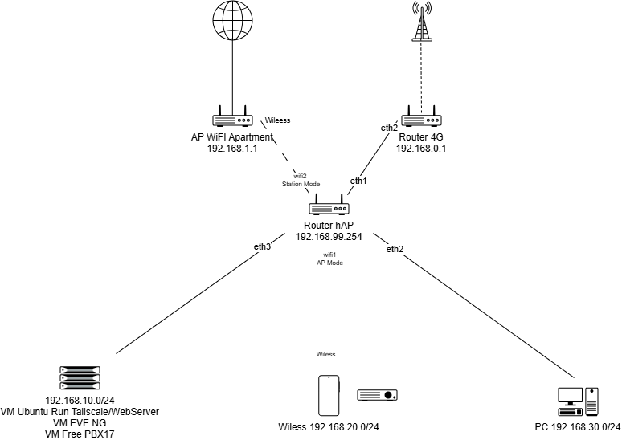

# 🚀 ANURAK-HOMELAB Infrastructure & Environment

เอกสารสรุปสถาปัตยกรรมระบบเครือข่าย เครื่องเซิร์ฟเวอร์ และบริการต่างๆ (Services) ภายในแล็บ **ANURAK-HOMELAB**[cite: 1]
* **Last Updated:** 2026-09-17[cite: 1]
* **Maintainer:** Anurak P.[cite: 1]
* **Environment:** Home/Lab Production Infrastructure[cite: 1]

---

## 📐 1. Network Topology & Architecture

[cite: 1]
* **WAN 1 (Primary):** AP WiFi Apartment (`192.168.1.1`) via `wifi2` (Station Mode)[cite: 1]
* **WAN 2 (Backup):** Router 4G (`192.168.0.1`) via `eth1`[cite: 1]
* **Routing Strategy:** Main Outbound via Apartment WiFi, Failover/Backup via 4G Router[cite: 1]
* **Netwatch Script (UP):** `/ip route enable [find comment="WAN1"]`[cite: 1]
* **Netwatch Script (Down):** `/ip route disable [find comment="WAN1"]`[cite: 1]

---

## 🔌 2. IP Addressing & Network Segmentation

| Subnet / Zone | Subnet Mask | Gateway (hAP) | Interface | Description / Target Devices |
| :--- | :--- | :--- | :--- | :--- |
| **Management** | `192.168.99.0/24` | `192.168.99.1` | Router hAP | Core Router Management & Infrastructure |[cite: 1]
| **Server Subnet**| `192.168.10.0/24` | `192.168.10.1` | `eth3` | Virtualization Host & Server VMs |[cite: 1]
| **Wireless Subnet**| `192.168.20.0/24`| `192.168.20.1` | `wifi1` | Mobile Devices & Wireless Clients |[cite: 1]
| **Client Subnet**  | `192.168.30.0/24` | `192.168.30.1` | `eth2` | Wired Workstation PC |[cite: 1]

---

## 🖥️ 3. Infrastructure & Virtualization Workloads

### 📦 Host Machine
* **Host Gateway/IP Zone:** `192.168.10.0/24` Zone (`eth3`)[cite: 1]

### 🤖 Virtual Machines (VMs)
| VM Name | IP Address | OS / Spec | Services & Software | Access / Description |
| :--- | :--- | :--- | :--- | :--- |
| **VM-Ubuntu** | `192.168.10.251` | Ubuntu Server | Cloudflare Tunnel Agent, Tailscale Subnet Router, WebServer | Inbound Edge Gateway / Web Server |[cite: 1]
| **VM-EVE-NG** | `192.168.10.252` | Linux | Network Emulation / Testing | Network Lab Simulation |[cite: 1]
| **VM-FreePBX**| `192.168.10.249` | FreePBX 17 | IP-PBX, Asterisk Voice Gateway | SIP/RTP Voice System |[cite: 1]

---

## 🌐 4. Custom Domain & Cloudflare Integration

* **Domain Registrar & Management:** Managed via Cloudflare Registrar (`labanurak.online`)[cite: 1]
* **Ingress Access Method:** Cloudflare Zero Trust Tunnels (`cloudflared` agent hosted on `VM-Ubuntu`)[cite: 1]
* **Security & Architecture Advantages:**
  * **Zero Open Inbound Ports:** ปลอดภัย 100% ไม่ต้องทำ Port Forwarding บน Router และไม่ต้องใช้ Public Static IP[cite: 1]
  * **Automatic TLS/SSL Provisioning:** ได้รับใบรับรองความปลอดภัย HTTPS อัตโนมัติจาก Cloudflare Edge[cite: 1]
  * **Edge Reverse Proxy:** ซ่อน IP เครื่องเซิร์ฟเวอร์จริงใน LAN ออกจากอินเทอร์เน็ตสาธารณะ[cite: 1]

### 🔗 Published Application Routes (Cloudflare Tunnel Hostnames)
| Public Domain / URL | Protocol | Target Internal Address | Description / Service |
| :--- | :--- | :--- | :--- |
| `https://web.labanurak.online` | `HTTP` | `http://192.168.10.251:80` | Internal Web Server (VM-Ubuntu) |[cite: 1]
| `https://eve.labanurak.online` | `HTTP` | `http://192.168.10.252:80` | Interactive EVE-NG Network Lab |[cite: 1]
| `https://pbx.labanurak.online` | `HTTPS` | `https://192.168.10.249:443` | FreePBX 17 Web Management Dashboard *(No TLS Verify)* |[cite: 1]

---

## 🔑 5. Remote Access & Overlay Network (Tailscale)
* **Tailscale Node:** VM Ubuntu (`192.168.10.251`)[cite: 1]
* **Routing Function:** Subnet Routing ข้ามไปหา IP วง internal (`192.168.10.0/24`, `192.168.0.1/24`)[cite: 1]
* **SIP Remote Client:** เชื่อมต่อ FreePBX 17 (`192.168.10.249`) ผ่าน IP ของ Tailscale (`100.X.X.X`) เพื่อข้าม NAT Issue[cite: 1]

---

## 🔒 6. Security & Isolation Policies
* **Inter-VLAN Rules:**
  * Block Traffic จาก Wireless Clients (`192.168.20.0/24`) ไม่ให้ข้ามไป Server Subnet (`192.168.10.0/24`) และ Client PC (`192.168.30.0/24`)[cite: 1]
* **Outbound NAT:**
  * Masquerade ทั้งวง ออกไปทาง `wifi2` และ `eth1`[cite: 1]

---

## 📜 7. Operational Changelog

* **2026-09-17:**
  * จดทะเบียนโดเมนประจำแล็บ **`labanurak.online`** ผ่าน Cloudflare Registrar[cite: 1]
  * ติดตั้งและกำหนดค่า Cloudflare Tunnel Connector (`cloudflared`) บน **VM-Ubuntu (`192.168.10.251`)**[cite: 1]
  * เปิดใช้งาน Published Application Routes สำหรับเข้าถึง `web.labanurak.online`, `eve.labanurak.online` และ `pbx.labanurak.online` ออกสู่ภายนอกแบบ Zero Open Ports[cite: 1]
* **2026-09-11:** 
  * ปรับโครงสร้าง Subnet แยก Port บน Router hAP (`eth2`: PC `192.168.30.0/24`, `eth3`: Server `192.168.10.0/24`) เพื่อแก้ปัญหา IP Conflict[cite: 1]
  * กำหนด IP ประจำตัวให้กับ VM Server (`.251`, `.252`, `.249`) และตั้งค่า Netwatch Failover บน Router hAP[cite: 1]
  * กำหนดชื่ออย่างเป็นทางการของแล็บเป็น **ANURAK-HOMELAB**[cite: 1]
