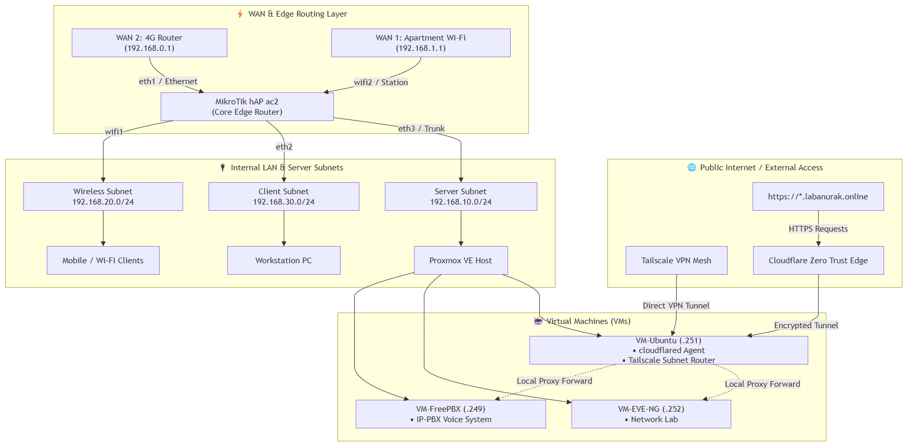
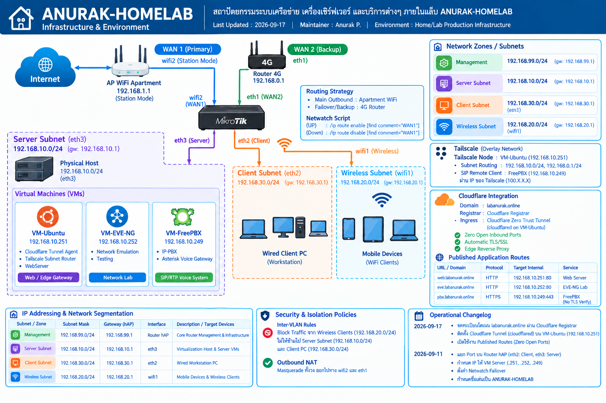
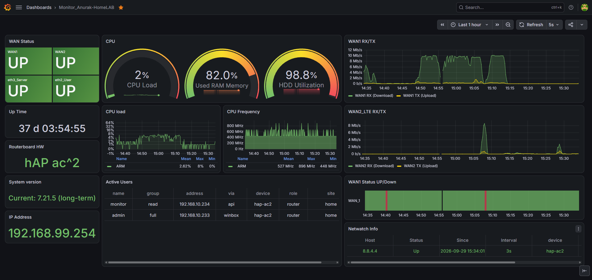

# 🚀 ANURAK-HOMELAB Infrastructure & Environment

เอกสารสรุปสถาปัตยกรรมระบบเครือข่าย เครื่องเซิร์ฟเวอร์ และบริการต่างๆ (Services) ภายในแล็บ **ANURAK-HOMELAB**
* **Last Updated:** 2026-09-29
* **Maintainer:** Anurak P.
* **Environment:** Home/Lab Production Infrastructure

---

## 📐 1. Network Topology & Architecture

* **WAN 1 (Primary):** AP WiFi Apartment (`192.168.1.1`) via `wifi2` (Station Mode)
* **WAN 2 (Backup):** Router 4G (`192.168.0.1`) via `eth1`
* **Routing Strategy:** Main Outbound via Apartment WiFi, Failover/Backup via 4G Router
* **Netwatch Script (UP):** `/ip route enable [find comment="WAN1"]`
* **Netwatch Script (Down):** `/ip route disable [find comment="WAN1"]`

---

## 🔌 2. IP Addressing & Network Segmentation

| Subnet / Zone | Subnet Mask | Gateway (hAP) | Interface | Description / Target Devices |
| :--- | :--- | :--- | :--- | :--- |
| **Management** | `192.168.99.0/24` | `192.168.99.1` | Router hAP | Core Router Management & Infrastructure |
| **Server Subnet**| `192.168.10.0/24` | `192.168.10.1` | `eth3` | Virtualization Host & Server VMs |
| **Wireless Subnet**| `192.168.20.0/24`| `192.168.20.1` | `wifi1` | Mobile Devices & Wireless Clients |
| **Client Subnet**  | `192.168.30.0/24` | `192.168.30.1` | `eth2` | Wired Workstation PC |

---

## 🖥️ 3. Infrastructure & Virtualization Workloads

### 📦 Host Machine
* **Host Gateway/IP Zone:** `192.168.10.0/24` Zone (`eth3`)

### 🤖 Virtual Machines (VMs)
| VM Name | IP Address | OS / Spec | Services & Software | Access / Description |
| :--- | :--- | :--- | :--- | :--- |
| **VM-Ubuntu** | `192.168.10.251` | Ubuntu Server | Cloudflare Tunnel Agent, Tailscale Subnet Router, WebServer | Inbound Edge Gateway / Web Server |
| **VM-EVE-NG** | `192.168.10.252` | Linux | Network Emulation / Testing | Network Lab Simulation |
| **VM-FreePBX**| `192.168.10.249` | FreePBX 17 | IP-PBX, Asterisk Voice Gateway | SIP/RTP Voice System |
| **VM-Monitoring**| `192.168.10.234` | Ubuntu Server  | Grafann, Prometheus, MKTXP Exporter | API Dashboard For Mikrotik |

---

## 📊 4. Observability & Monitoring Stack (Grafana + Prometheus + MKTXP)

* **Monitoring Host / VM:** `192.168.10.234` (Ubuntu Server 22.04 LTS / Docker Compose Stack)
* **API Connection:** RouterOS API (`TCP 8728`) เชื่อมต่อกับ MikroTik hAP ac² (`192.168.99.254`)
* **Exporter (MKTXP v1.2.19):** ดึงค่า System Metrics, Interface Traffic (WAN1/WAN2), และ Netwatch Status ที่ Port `49090` (Internal Docker Network)
* **Metrics Storage (Prometheus):** Scrape interval ทุก 10 วินาที พร้อม Alert Rules แจ้งเตือนเมื่อ WAN1 Down และ WAN2 Up
* **Visualization (Grafana):** Dashboard แสดงผล Uptime, CPU/RAM Usage, WAN Traffic (Rx/Tx), และ Interface Running Status

---

## 🌐 5. Custom Domain & Cloudflare Integration

* **Domain Registrar & Management:** Managed via Cloudflare Registrar (`labanurak.online`)
* **Ingress Access Method:** Cloudflare Zero Trust Tunnels (`cloudflared` agent hosted on `VM-Ubuntu`)
* **Security & Architecture Advantages:**
  * **Zero Open Inbound Ports:** ปลอดภัย 100% ไม่ต้องทำ Port Forwarding บน Router และไม่ต้องใช้ Public Static IP
  * **Automatic TLS/SSL Provisioning:** ได้รับใบรับรองความปลอดภัย HTTPS อัตโนมัติจาก Cloudflare Edge
  * **Edge Reverse Proxy:** ซ่อน IP เครื่องเซิร์ฟเวอร์จริงใน LAN ออกจากอินเทอร์เน็ตสาธารณะ

### 🔗 Published Application Routes (Cloudflare Tunnel Hostnames)
| Public Domain / URL | Protocol | Target Internal Address | Description / Service |
| :--- | :--- | :--- | :--- |
| `https://web.labanurak.online` | `HTTP` | `http://192.168.10.251:80` | Internal Web Server (VM-Ubuntu) |
| `https://eve.labanurak.online` | `HTTP` | `http://192.168.10.252:80` | Interactive EVE-NG Network Lab *(WebSockets Enabled)* |
| `https://freepbx.labanurak.online` | `HTTPS` | `https://192.168.10.249:443` | FreePBX 17 Web Management Dashboard *(No TLS Verify)* |
| `https://monitor.labanurak.online` | `HTTPS` | `https://192.168.10.234:3000` | Grafana Web Management Dashboard *(No TLS Verify)* |

---

## 🔑 6. Remote Access & Overlay Network (Tailscale)
* **Tailscale Node:** VM Ubuntu (`192.168.10.251`)
* **Routing Function:** Subnet Routing ข้ามไปหา IP วง internal (`192.168.10.0/24`, `192.168.0.1/24`)
---

## 🔒 7. Security & Isolation Policies
* **Inter-VLAN Rules:**
  * Block Traffic จาก Wireless Clients (`192.168.20.0/24`) ไม่ให้ข้ามไป Server Subnet (`192.168.10.0/24`) และ Client PC (`192.168.30.0/24`)
* **Outbound NAT:**
  * Masquerade ทั้งวง ออกไปทาง `wifi2` และ `eth1`

---

## 📜 8. Operational Changelog

* **2026-09-26:**
  * ปรับปรุงขั้นตอนและเอกสารติดตั้ง Monitoring Stack (Grafana + Prometheus + MKTXP v1.2.19) บน Docker Compose
  * เปิดใช้งาน Published Application Routes สำหรับเข้าถึง `monitor.labanurak.online` ออกสู่ภายนอกแบบ Zero Open Ports
* **2026-09-17:**
  * จดทะเบียนโดเมนประจำแล็บ **`labanurak.online`** ผ่าน Cloudflare Registrar
  * ติดตั้งและกำหนดค่า Cloudflare Tunnel Connector (`cloudflared`) บน **VM-Ubuntu (`192.168.10.251`)**
  * เปิดใช้งาน Published Application Routes สำหรับเข้าถึง `web.labanurak.online`, `eve.labanurak.online` และ `freepbx.labanurak.online` ออกสู่ภายนอกแบบ Zero Open Ports
* **2026-09-11:** 
  * ปรับโครงสร้าง Subnet แยก Port บน Router hAP (`eth2`: PC `192.168.30.0/24`, `eth3`: Server `192.168.10.0/24`) เพื่อแก้ปัญหา IP Conflict
  * กำหนด IP ประจำตัวให้กับ VM Server (`.251`, `.252`, `.249`) และตั้งค่า Netwatch Failover บน Router hAP
  * กำหนดชื่ออย่างเป็นทางการของแล็บเป็น **ANURAK-HOMELAB**
